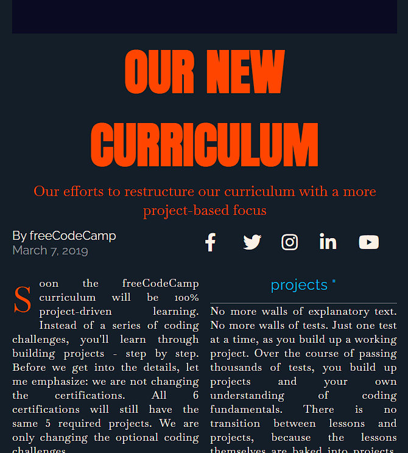

# FreeCodeCamp Magazine

Building a magazine page with CSS grid

## Preview

In this course I better understood these concepts:

- The `loading`attribute on an `img` element can be set to `lazy` to tell the browser not to fetch the image resource until it is needed.
- The `Referer` HTTP header allows a server to identify referring pages that people are visiting from or where requested resources are being used. This data can be used for analytics, logging, optimized caching, and more.
- **CSS Grid** offers a two-dimensional grid-based layout, allowing you to center items horizontally and vertically while still retaining control to do things like overlap elements.
- Use the `minmax`function to make your columns responsive on any device. It takes two arguments, the first being the minimum value and the second being the maximum. These values could be a length, percentage, `fr`, or even a keyword like `max-content`
- `grid-column` property tells the grid item which grid line to start and end at.
- The CSS `repeat()`function is used to repeat a value, rather than writing it out manually.
- The `object-fit`property tells the browser how to position the element within its container.
- The **`grid-auto-flow`** CSS property controls how the auto-placement algorithm works, specifying exactly how auto-placed items get flowed into the grid.
- The **`column-width`** CSS property sets the ideal column width in a multi-column layout. The container will have as many columns as can fit without any of them having a width less than the `column-width` value.
- The `::first-letter` pseudo-selector allows you to target the first letter in the text content of an element.
- The `place-items` property can be used to set the `align-items` and `justify-items` values at the same time. The `place-items` property takes one or two values. If one value is provided, it is used for both the `align-items` and `justify-items` properties. If two values are provided, the first value is used for the `align-items` property and the second value is used for the `justify-items` property.

## Conclusion

My current goal is to master React, but first I need to complete some begginer courses on FreeCodeCamp, but at the same time I'm learning some new things like I pointed above.
